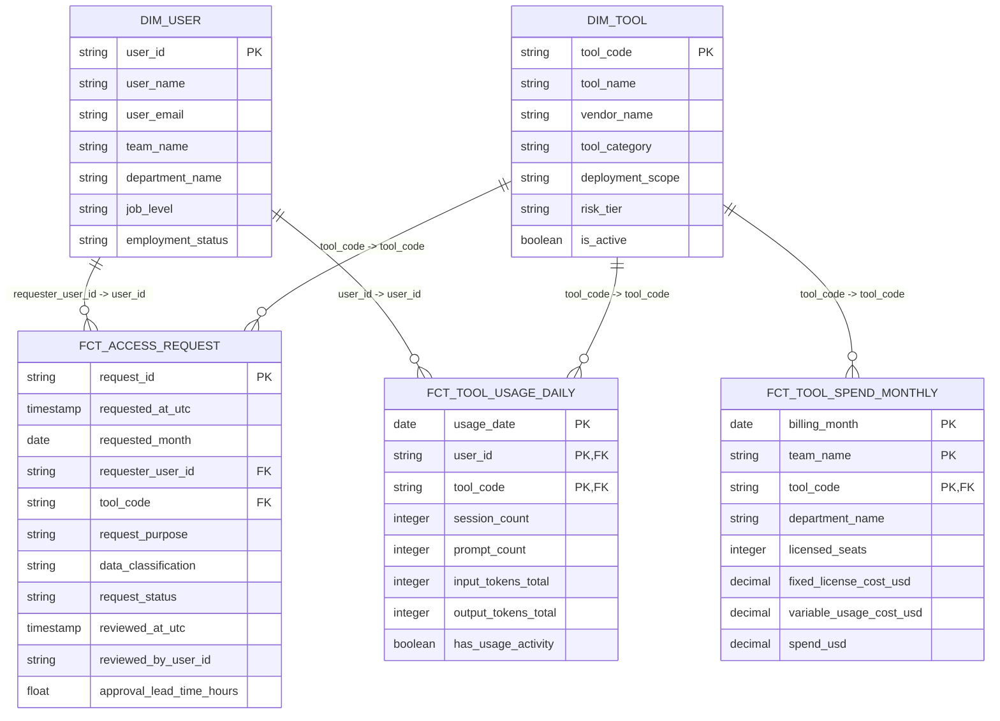

# access-governance-warehouse

企業向け AI ツールのアクセスガバナンス（access governance）を題材にした、ローカルウェアハウス（local warehouse）かつ dbt analytics engineering のポートフォリオプロジェクトです。

このリポジトリは、決定論的に生成した synthetic source data を、明示的な dbt レイヤー、データ品質テスト（data quality tests）、ドキュメント化、static governance report を通じて、小さくても信頼できる分析用ウェアハウス（analytical warehouse）にモデル化する流れを示します。

主眼はウェアハウスモデリング（warehouse-oriented modeling）であり、アプリケーション UI（application user interface）ではありません。

---

## 概要

`access-governance-warehouse` は、企業向け AI ツールのアクセスガバナンス（access governance）に関する分析レイヤー（analytical layer）をモデル化するプロジェクトです。

決定論的な synthetic raw Parquet files から始まり、それをローカル DuckDB-backed dbt project に読み込み、governance、adoption、usage、spend に関する問いに答えるビジネス向け mart（business-facing marts）を生成します。

このプロジェクトは、次の点を示すことを目的としています。

- 決定論的な synthetic raw data generation
- raw source contracts
- レイヤー化された dbt modeling
- 再利用可能なディメンション（dimensions）とファクト（facts）
- intermediate layer における stock / flow logic
- ビジネス向け mart（business-facing marts）
- データ品質テスト（data quality tests）
- dbt documentation and lineage
- 生成済みの static governance report

このリポジトリは、関連する Django application repository と概念的に対応しています。  
ただし、v0.1.0 では live application extraction ではなく、決定論的な file-based synthetic data を使用します。

---

## 短時間レビュー向けの確認順序（Quick Review Path）

短時間でポートフォリオとして確認する場合は、まず生成済み report を確認し、その後に補助的な設計文書を読む構成を推奨します。

| 手順 | 開くもの | 目的 |
|---:|---|---|
| 1 | [`artifacts/reports/governance_report_v0_1_0.md`](artifacts/reports/governance_report_v0_1_0.md) | mart layer から生成されたビジネス向け出力を確認する |
| 2 | [`docs/domain-modeling-and-assumptions.ja.md`](docs/domain-modeling-and-assumptions.ja.md) | model grain、assumptions、scope boundaries を確認する |
| 3 | [`docs/testing-strategy.ja.md`](docs/testing-strategy.ja.md) | dbt testing strategy と validation philosophy を確認する |
| 4 | [`docs/generator_source_contract_and_design_summary.ja.md`](docs/generator_source_contract_and_design_summary.ja.md) | 決定論的な synthetic raw source contract を確認する |
| 5 | `models/marts/governance/` | ビジネス向け mart SQL を確認する |

---

## ハイライト

- DuckDB と dbt を用いた end-to-end のローカル analytics engineering workflow
- 明示的な source contracts を持つ決定論的な synthetic raw data
- sources、staging、core、intermediate、marts へ展開する layered dbt models
- source contracts、grains、reconciliation、mart logic を対象とする 315 件の dbt data tests
- ビジネス向け mart から生成される static governance report
- data transformation failures と business review signals の明確な分離

---

## 業務上の問い（Business Questions）

この warehouse は、次の 4 つの焦点を絞った業務上の問い（business questions）に答えることを目的としています。

1. どのチームが、どのツールを、いつ申請・承認・却下しているか
2. 承認されたツールが実際に使われているか
3. 承認なしの利用がある user-tool 関係はどれか
4. 費用（spend）が導入・定着状況（adoption）や利用状況（usage）と方向性として整合しているか

---

## 構成（Architecture）

```text
Synthetic raw Generator
        |
        v
data/raw/*.parquet
        |
        v
DuckDB local warehouse
        |
        v
dbt sources
        |
        v
staging models
        |
        v
core dimensions and facts
        |
        v
intermediate governance models
        |
        v
business-facing marts
        |
        v
static governance report
```

dbt model の流れは次の通りです。

```text
sources -> staging -> core -> intermediate -> marts
```

---

## dbt lineage（データ系譜）

以下の dbt lineage graph は、raw sources、staging models、core dimensions and facts、intermediate models、marts、data tests がどのように接続されているかを示します。

この画像は、細部を読み込むための図ではなく、モデル化された dependency graph が構成されていることを一目で確認してもらうための図です。


---

## Core 層の ERD（Entity Relationship Diagram）

次の diagram は、core layer における dimension / fact の join paths を要約したものです。



> Note: この ERD における relationships は、dbt tests によって検証される warehouse-level の参照解決可能性（resolvability）と join paths を表します。DuckDB 上の物理的な foreign key constraints を意味するものではありません。

---

## このプロジェクトが示すこと

このリポジトリは、analytics engineering ポートフォリオ成果物として作成されています。

次の能力を示すことを目的としています。

- 分析用データ（analytical data）の source contracts を設計すること
- レイヤー化された dbt project を構築すること
- model grain を保ち、文書化すること
- transformation failures と business review signals を分離すること
- generic / singular data tests で models を検証すること
- stock / flow metrics の両方をモデル化すること
- marts から reviewer-facing analytical outputs を生成すること
- assumptions と scope boundaries を明確に文書化すること

---

## データドメイン（Data Domain）

モデル化している domain は、企業向け AI ツールのアクセスガバナンス（access governance）です。

synthetic dataset には次の領域が含まれます。

| 領域 | モデル化対象 |
|---|---|
| ツールカタログ（Tool catalog） | 企業向け AI ツール |
| ユーザーディレクトリ（User directory） | 現在状態のユーザー、team、department、job level |
| アクセス申請（Access requests） | final review state を持つ request workflow rows |
| 利用実績（Usage） | daily user-tool usage activity |
| 費用（Spend） | monthly team-tool billing rows |
| ガバナンス例外（Governance exceptions） | current user-tool exception signals |
| adoption レビュー候補（Adoption review candidates） | monthly team-tool follow-up signals |

---

## Raw source tables

Generator は `data/raw/` 配下に 5 つの raw Parquet files を出力します。

| Raw source | 粒度（Grain） |
|---|---|
| `raw_tool_catalog` | tool ごとに1行 |
| `raw_user_directory` | user ごとに1行 |
| `raw_access_requests` | access request ごとに1行 |
| `raw_usage_events_daily` | recorded activity がある user、tool、day ごとに1行 |
| `raw_tool_spend_monthly` | billed month、team、tool ごとに1行 |

これらの raw files は synthetic、deterministic、locally reproducible です。

---

## dbt model layers

| レイヤー | 目的 |
|---|---|
| Sources | raw Parquet input contracts を定義する |
| Staging | raw grain を保ったまま raw fields を標準化する |
| Core | 再利用可能なディメンション（dimensions）とファクト（facts）を定義する |
| Intermediate | re-graining、stock logic、mart support logic を切り出す |
| Marts | ビジネス向け分析出力（business-facing analytical outputs）を提供する |

---

## 主要 mart（Key Marts）

主要な business-facing marts は次の通りです。

| Mart | 粒度（Grain） | 目的 |
|---|---|---|
| `access_requests_monthly` | reporting month、team、tool ごとに1行 | request inflow、approval/rejection flow、month-end backlog を要約する |
| `tool_adoption_monthly` | reporting month、team、tool ごとに1行 | approved access、monthly usage、spend、adoption alignment を比較する |
| `adoption_review_candidates_monthly` | reporting month、team、tool ごとに1行 | monthly adoption、usage、spend review candidates を分類する |
| `governance_exceptions_current` | user、tool ごとに1行 | current approval と recent usage の exception review を支援する |

---

## 静的ガバナンスレポート（Static Governance Report）

このリポジトリには、生成済みの static governance report が含まれます。

```text
artifacts/reports/governance_report_v0_1_0.md
```

この report は、dbt mart layer から次のコマンドで生成されます。

```bash
uv run python scripts/build_governance_report.py
```

report は次の内容を要約します。

- 申請傾向（request trends）
- 承認・却下の流れ（approval / rejection flow）
- ツール導入・定着状況（tool adoption）
- 利用状況と費用の整合性（usage / spend alignment）
- レビュー候補（review candidates）
- 現在のガバナンス例外（current governance exceptions）

### レポート概要（Report Snapshot）

生成済み report は、現在次の mart-level signals を要約しています。

| 指標 | 値 |
|---|---:|
| Total access requests | 553 |
| Decision approval rate | 77.1% |
| Latest month-end pending requests | 30 |
| Total sessions | 61,970 |
| Total spend | $153,913.72 |
| Current used-without-approval exceptions | 8 |
| Current approved-but-inactive cases | 24 |

これらの数値は、決定論的な synthetic data から生成されたものです。実際の operational metrics ではなく、再現可能な portfolio dataset として読むべきものです。

report は次の mart tables から読み込みます。

```text
main.access_requests_monthly
main.tool_adoption_monthly
main.adoption_review_candidates_monthly
main.governance_exceptions_current
```

report は、mart が所有する business classifications を Python 側で再計算しません。

---

## クイックスタート（Quick Start）

### 1. Repository を clone する

```bash
git clone https://github.com/ShikiIchitose/access-governance-warehouse.git
cd access-governance-warehouse
```

### 2. 依存関係（dependencies）を install する

```bash
uv sync
```

### 3. dbt profile を設定する

```bash
cp profiles/profiles.yml.example profiles/profiles.yml
```

このプロジェクトは、次の local DuckDB database file を使用する想定です。

```text
data/warehouse/access_governance.duckdb
```

### 4. コミット済みのサンプル raw data を使用する

このリポジトリには、次の場所に小さな決定論的 sample raw dataset が含まれています。

```text
data/raw/
```

これらの Parquet files は synthetic かつ deterministic であり、短時間で dbt を確認するための default local source fixture として用意されています。

Generator から raw files を再生成したい場合は、次を実行してください。

```bash
uv run python -m scripts.generate_synthetic_raw
```

### 5. 生成された raw Parquet files を確認する

dbt warehouse を build する前に、必要に応じて DuckDB から生成済み raw Parquet files を直接確認できます。

```bash
duckdb < scripts/inspect_generated_raw_parquet.sql
```

この inspection script は、生成された raw layer に対するローカル sanity checks を目的としています。たとえば、row counts、schemas、preview rows、distributions、duplicate smoke checks、spend-math smoke checks を確認できます。

これは canonical な validation mechanism ではありません。Generator validation artifacts と dbt tests が主要な validation surface です。

### 6. warehouse を build する

```bash
uv run dbt build
```

このコマンドは、dbt models と tests を dependency order に従って実行します。

### 7. static report を生成する

```bash
uv run python scripts/build_governance_report.py
```

生成された report は次に出力されます。

```text
artifacts/reports/governance_report_v0_1_0.md
```

---

## 主要コマンド（Core Commands）

### dbt project を parse する

```bash
uv run dbt parse
```

### full dbt build を実行する

```bash
uv run dbt build
```

### すべての dbt tests を実行する

```bash
uv run dbt test
```

### generic tests のみを実行する

```bash
uv run dbt test --select "test_type:generic"
```

### singular tests のみを実行する

```bash
uv run dbt test --select "test_type:singular"
```

### 生成された raw Parquet files を確認する

```bash
duckdb < scripts/inspect_generated_raw_parquet.sql
```

### dbt documentation を生成する

```bash
uv run dbt docs generate
```

### dbt documentation をローカルで表示する

```bash
uv run dbt docs serve
```

### static governance report を生成する

```bash
uv run python scripts/build_governance_report.py
```

---

## テスト方針（Testing Strategy）

この test suite は、業務レビューシグナル（business review signals）が marts に現れることを許容しつつ、変換処理の正当性（transformation correctness）を検証するように設計されています。

現在の v0.1.0 validation baseline では、次の tests が含まれます。

| テスト区分 | 件数 |
|---|---:|
| generic tests | 278 |
| core singular tests | 7 |
| intermediate singular tests | 12 |
| mart singular tests | 18 |
| data tests 合計 | 315 |

### 検証ベースライン（Validation Baseline）

代表的なローカル `dbt build` は、次の検証ベースラインを満たして正常に完了しています。

```text
dbt=1.11.8
duckdb=1.10.1
Found 315 data tests, 19 models, 5 sources, 475 macros
Finished running 4 table models, 315 data tests, 15 view models
Done. PASS=334 WARN=0 ERROR=0 SKIP=0 NO-OP=0 TOTAL=334
```

このテスト方針では、次の 2 つを明確に区別します。

| 区分 | 意味 |
|---|---|
| 変換処理の失敗（transformation failure） | dbt tests で失敗させるべき、構造的または論理的な欠陥 |
| 業務レビューシグナル（business review signal） | marts に分析出力として現れるべき、意味のある業務上の確認対象 |

変換処理の失敗（transformation failures）の例は次の通りです。

- 定義された粒度（declared grain）における重複行
- 列挙型に近い値（enum-like values）の不正値
- 外部キーに近い関係（foreign key-like relationships）の参照切れ
- 利用指標（usage metrics）または費用指標（spend metrics）の負の値
- 上流モデル（upstream models）と下流モデル（downstream models）の間の集計不整合（reconciliation mismatch）

業務レビューシグナル（business review signals）の例は次の通りです。

- 承認済み access なしの usage
- recent usage がない承認済み access
- billing row がない usage
- usage がない billing
- 優先度の高い review candidates

原則は次の通りです。

```text
Business exceptions are outputs. Transformation inconsistencies are failures.
```

つまり、業務上の例外（business exceptions）は分析出力として marts に表示し、変換処理の不整合（transformation inconsistencies）は dbt tests で失敗させる、という方針です。

---

## 品質確認（Quality Checks）

このリポジトリでは、v0.1.0 において意図的に軽量な CI setup を採用しています。

Continuous integration では、現在 Ruff lint / format checks のみを実行します。主要な data validation surface は dbt data testing であり、ローカルでは次のコマンドで実行します。

```bash
uv run dbt build
```

`pytest` は v0.1.0 では使用していません。このプロジェクトの主要な correctness checks は、dbt generic tests、dbt singular tests、generator validation artifacts として表現されているためです。

---

## リポジトリ構成（Repository Structure）

```text
access-governance-warehouse/
├─ README.md
├─ README.ja.md
├─ pyproject.toml
├─ uv.lock
├─ dbt_project.yml
├─ profiles/
│  └─ profiles.yml.example
├─ data/
│  ├─ raw/
│  └─ warehouse/
├─ models/
│  ├─ sources/
│  ├─ staging/
│  ├─ core/
│  ├─ intermediate/
│  └─ marts/
├─ tests/
│  └─ singular/
├─ scripts/
│  ├─ generate_synthetic_raw.py
│  ├─ inspect_generated_raw_parquet.sql
│  └─ build_governance_report.py
├─ generator/
├─ docs/
└─ artifacts/
   ├─ reports/
   └─ validation/
```

---

## ドキュメント一覧（Documentation Map）

| 文書 | 目的 |
|---|---|
| [`docs/domain-modeling-and-assumptions.ja.md`](docs/domain-modeling-and-assumptions.ja.md) | domain assumptions、model grain、scope boundaries を説明する |
| [`docs/testing-strategy.ja.md`](docs/testing-strategy.ja.md) | testing philosophy、layer-level coverage、validation commands を説明する |
| [`docs/generator_source_contract_and_design_summary.ja.md`](docs/generator_source_contract_and_design_summary.ja.md) | compact generator source contract and design summary を説明する |
| [`artifacts/reports/governance_report_v0_1_0.md`](artifacts/reports/governance_report_v0_1_0.md) | generated static governance report |

---

## 重要なモデリング前提

このリポジトリは、意図的に bounded な v0.1.0 model として構成されています。

主な前提は次の通りです。

- user directory は current-state only である
- historical organization membership はモデル化しない
- access requests は request-level final-state rows として表現する
- usage は event grain ではなく daily aggregated grain で表現する
- spend は monthly team-tool grain で表現する
- approved access は approval 後に persistent として扱う
- revocation はモデル化しない
- dataset は synthetic かつ deterministic である
- warehouse は audit-grade な historical access state reconstruction ではない

これらの前提は、プロジェクトを compact で inspectable に保ち、ローカル analytics engineering portfolio として扱いやすくするためのものです。

---

## 粒度を意識した解釈（Grain-aware Interpretation）

各 dbt model には、明示的な粒度（grain）があります。

metrics は、その metrics を公開している model の粒度で解釈する必要があります。

たとえば、`tool_adoption_monthly` は reporting month、team、tool grain です。`approved_users_total` を team-tool rows across で合計しても、global distinct user count として解釈すべきではありません。同じ user が複数の tools について approved access を持つ場合、その user は複数の team-tool rows に寄与し得るためです。

異なる grain が必要な場合は、downstream report が aggregated rows から失われた detail を推測するのではなく、warehouse 側でその grain の model または mart を公開するべきです。

---

## Synthetic Generator の役割

Synthetic Generator は、このリポジトリにおける補助コンポーネントです。

その役割は、決定論的で確認しやすく、warehouse でそのまま扱える raw source files を提供することです。

このリポジトリにおける reviewer-facing な主な価値は、下流の warehouse 実装にあります。

- source definitions
- staging models
- dimensions and facts
- intermediate models
- marts
- tests
- dbt documentation
- static governance reporting

したがって、Generator は主役となるポートフォリオ成果物ではなく、source-layer contract provider として理解するのが適切です。

`data/raw/` 配下にコミットされているファイルは、短時間のローカル確認に使うための default deterministic sample source fixture です。Generator を実行することで、現在のリポジトリ設定に基づいてこれらの raw files を再生成できます。

コミット済みの raw Parquet files は、default sample dataset として扱います。同じ configuration のもとで再生成した場合、論理的な dataset は安定していることが期待されます。ただし、ファイルの更新日時は変わることがあります。

このリポジトリには、raw Parquet outputs 向けの DuckDB inspection script も含まれます。

```text
scripts/inspect_generated_raw_parquet.sql
```

これは raw data generation 後のローカル確認に使用できます。

```bash
duckdb < scripts/inspect_generated_raw_parquet.sql
```

この script は inspection aid です。canonical な validation mechanism そのものではありません。

---

## 関連プロジェクト（Related Project）

この warehouse は、関連する Django portfolio project と概念的に対応しています。

[`ai-tool-access-requests`](https://github.com/ShikiIchitose/ai-tool-access-requests)

関連プロジェクトは、企業向け AI ツールの access request / approval workflow を扱う minimal Django application です。

このリポジトリは、そのような application の後段に位置し得る downstream analytical warehouse layer に焦点を当てています。access request data、usage activity、spend data を governance、adoption、review outputs に変換する方法をモデル化します。

v0.1.0 では、この warehouse は Django application から live data を抽出しません。このリポジトリの raw data は synthetic、deterministic、file-based です。

application UI は Django repository 側の責務です。このリポジトリは warehouse modeling、dbt transformations、data tests、documentation、static reporting に焦点を当てています。

---

## スコープ境界（Scope Boundaries）

このリポジトリの対象範囲は次の通りです。

- local DuckDB warehouse modeling
- dbt transformations
- deterministic synthetic raw data
- data tests
- dbt documentation
- static Markdown reporting

次の内容は、v0.1.0 のスコープ外です。

- production orchestration（本番用オーケストレーション）
- live source extraction（ライブデータ抽出）
- cloud warehouse deployment（クラウドウェアハウスへのデプロイ）
- dashboard application development（ダッシュボードアプリケーション開発）
- application user interface implementation（アプリケーション UI 実装）
- real access provisioning（実際のアクセス付与）
- real audit trails（実際の監査証跡）
- slowly changing user dimensions（履歴付きユーザーディメンション）
- access revocation（アクセス剥奪）
- audit-grade access reconstruction（監査レベルのアクセス状態再構築）
- historical organization snapshots（履歴付き組織スナップショット）

これらは意図的に除外しています。  
これにより、このプロジェクトは最小限で確認しやすい dbt warehouse に焦点を保っています。

---

## レビュー手順（Reviewer Guide）

推奨する確認順序は次の通りです。

1. この `README.ja.md` から始める
2. 生成済み report を開く
   - `artifacts/reports/governance_report_v0_1_0.md`
3. mart models を確認する
   - `models/marts/governance/`
4. testing strategy を確認する
   - `docs/testing-strategy.md`
5. domain assumptions を確認する
   - `docs/domain-modeling-and-assumptions.ja.md`
6. dbt documentation をローカルで生成・確認する
   - `uv run dbt docs generate`
   - `uv run dbt docs serve`

---

## 現在の状態

v0.1.0 は、ローカルで再現可能な analytics engineering ポートフォリオプロジェクトです。

決定論的な raw data generation から、dbt modeling、testing、documentation、mart outputs、static reporting までの小規模な warehouse workflow 全体を示すことを目的としています。

## License

MIT License. See `LICENSE` file.
