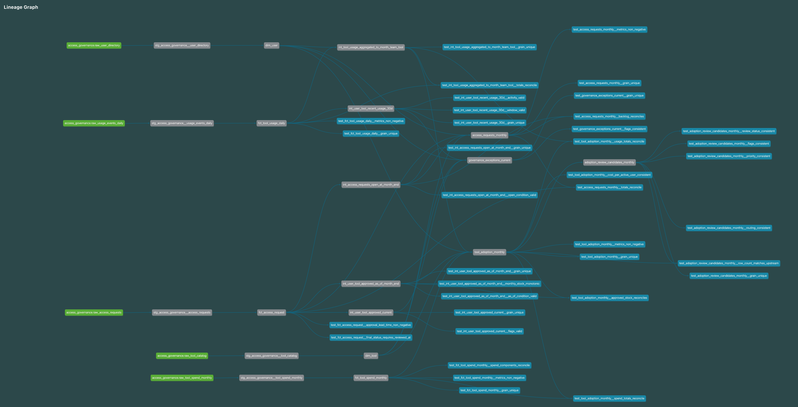
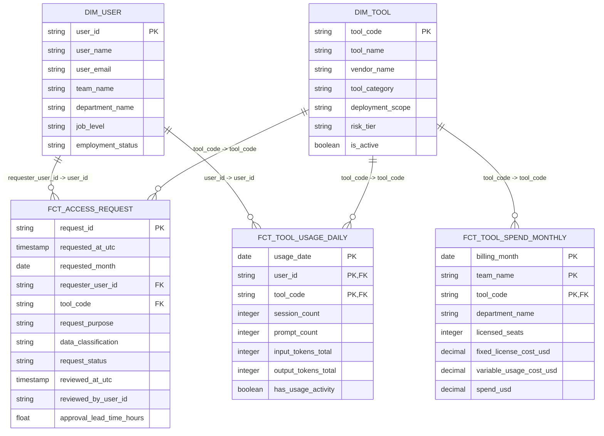

# access-governance-warehouse

> 日本語版: [README.ja.md](README.ja.md)

A local DuckDB + dbt analytics engineering portfolio project for enterprise artificial intelligence access governance.

This repository demonstrates how deterministic synthetic source data can be modeled into a small but credible analytical warehouse using explicit dbt layers, data tests, documentation, and a static governance report.

The focus is warehouse-oriented modeling, not an application user interface.

---

## Overview

`access-governance-warehouse` models an analytical layer for enterprise artificial intelligence tool access governance.

It starts from deterministic synthetic raw Parquet files, loads them through a local DuckDB-backed dbt project, and produces business-facing marts that answer governance, adoption, usage, and spend questions.

The project is designed to demonstrate:

- deterministic synthetic raw data generation
- raw source contracts
- layered dbt modeling
- reusable dimensions and facts
- intermediate stock and flow logic
- business-facing marts
- data quality tests
- dbt documentation and lineage
- a generated static governance report

This repository is conceptually paired with the related Django application repository, but v0.1.0 uses deterministic file-based synthetic data rather than live application extraction.

---

## Quick review path

For a fast portfolio review, start with the generated report and then inspect the supporting design documents.

| Step | What to open | Why |
|---:|---|---|
| 1 | [`artifacts/reports/governance_report_v0_1_0.md`](artifacts/reports/governance_report_v0_1_0.md) | See the business-facing output generated from the mart layer |
| 2 | [`docs/domain-modeling-and-assumptions.md`](docs/domain-modeling-and-assumptions.md) | Understand model grain, assumptions, and scope boundaries |
| 3 | [`docs/testing-strategy.md`](docs/testing-strategy.md) | Understand the dbt testing strategy and validation philosophy |
| 4 | [`docs/generator_source_contract_and_design_summary.md`](docs/generator_source_contract_and_design_summary.md) | Understand the deterministic synthetic raw source contract |
| 5 | `models/marts/governance/` | Inspect the business-facing mart SQL |

---

## Highlights

- End-to-end local analytics engineering workflow using DuckDB and dbt.
- Deterministic synthetic raw data with explicit source contracts.
- Layered dbt models from sources to staging, core, intermediate, and marts.
- 315 dbt data tests covering source contracts, grains, reconciliation, and mart logic.
- Static governance report generated from business-facing marts.
- Clear separation between data transformation failures and business review signals.

---

## Business questions

The warehouse is designed to answer four focused questions:

1. Which teams request, approve, or reject which tools over time?
2. Are approved tools actually used?
3. Which user-tool relationships show usage without approved access?
4. Is spend directionally aligned with adoption and usage?

---

## Architecture

```text
Synthetic raw generator
        |
        v
data/raw/*.parquet
        |
        v
DuckDB local warehouse
        |
        v
dbt sources
        |
        v
staging models
        |
        v
core dimensions and facts
        |
        v
intermediate governance models
        |
        v
business-facing marts
        |
        v
static governance report
```

The dbt model flow is:

```text
sources -> staging -> core -> intermediate -> marts
```

---

## dbt lineage

The dbt lineage graph below shows how raw sources, staging models, core dimensions and facts, intermediate models, marts, and data tests are connected.

This image is intended as a high-level visual proof of the modeled dependency graph, not as a detailed reading surface.



---

## Core entity relationship diagram

The diagram below summarizes the core dimension and fact join paths.



> Note: Relationships in this ERD represent warehouse-level resolvability and join paths validated by dbt tests. They are not physical database foreign key constraints in DuckDB.

---

## What this project demonstrates

This repository is intended as an analytics engineering portfolio artifact.

It demonstrates the ability to:

- design source contracts for analytical data
- build a layered dbt project
- preserve and document model grain
- separate transformation failures from business review signals
- validate models with generic and singular data tests
- model both stock and flow metrics
- generate reviewer-facing analytical outputs from marts
- document assumptions and scope boundaries clearly

---

## Data domain

The modeled domain is enterprise artificial intelligence tool access governance.

The synthetic dataset includes:

| Area | Modeled object |
|---|---|
| Tool catalog | Enterprise artificial intelligence tools |
| User directory | Current-state users, teams, departments, and job levels |
| Access requests | Request workflow rows with final review state |
| Usage | Daily user-tool usage activity |
| Spend | Monthly team-tool billing rows |
| Governance exceptions | Current user-tool exception signals |
| Adoption review candidates | Monthly team-tool follow-up signals |

---

## Raw source tables

The generator emits five raw Parquet files under `data/raw/`:

| Raw source | Grain |
|---|---|
| `raw_tool_catalog` | One row per tool |
| `raw_user_directory` | One row per user |
| `raw_access_requests` | One row per access request |
| `raw_usage_events_daily` | One row per user, tool, and day with recorded activity |
| `raw_tool_spend_monthly` | One row per billed month, team, and tool |

The raw files are synthetic, deterministic, and locally reproducible.

---

## dbt model layers

| Layer | Purpose |
|---|---|
| Sources | Define raw Parquet input contracts |
| Staging | Standardize raw fields while preserving raw grain |
| Core | Define reusable dimensions and facts |
| Intermediate | Isolate stock logic, re-graining, and reusable mart support logic |
| Marts | Provide business-facing analytical outputs |

---

## Key marts

The primary business-facing marts are:

| Mart | Grain | Purpose |
|---|---|---|
| `access_requests_monthly` | Reporting month, team, and tool | Request inflow, approval/rejection flow, and month-end backlog |
| `tool_adoption_monthly` | Reporting month, team, and tool | Approved access, monthly usage, spend, and adoption alignment |
| `adoption_review_candidates_monthly` | Reporting month, team, and tool | Monthly adoption, usage, and spend review candidates |
| `governance_exceptions_current` | User and tool | Current approval and recent usage exception review |

---

## Static governance report

The repository includes a generated static governance report:

```text
artifacts/reports/governance_report_v0_1_0.md
```

The report is generated from the dbt mart layer by:

```bash
uv run python scripts/build_governance_report.py
```

The report summarizes:

- request trends
- approval and rejection flow
- tool adoption
- usage and spend alignment
- review candidates
- current governance exceptions

### Report snapshot

The generated report currently summarizes the following mart-level signals:

| Metric | Value |
|---|---:|
| Total access requests | 553 |
| Decision approval rate | 77.1% |
| Latest month-end pending requests | 30 |
| Total sessions | 61,970 |
| Total spend | $153,913.72 |
| Current used-without-approval exceptions | 8 |
| Current approved-but-inactive cases | 24 |

These figures are generated from deterministic synthetic data and should be read as a reproducible portfolio dataset, not as real operational metrics.

The report reads from these mart tables:

```text
main.access_requests_monthly
main.tool_adoption_monthly
main.adoption_review_candidates_monthly
main.governance_exceptions_current
```

The report does not recompute mart-owned business classifications in Python.

---

## Quick start

### 1. Clone the repository

```bash
git clone https://github.com/ShikiIchitose/access-governance-warehouse.git
cd access-governance-warehouse
```

### 2. Install dependencies

```bash
uv sync
```

### 3. Configure the dbt profile

```bash
cp profiles/profiles.yml.example profiles/profiles.yml
```

The project is designed to use a local DuckDB database file:

```text
data/warehouse/access_governance.duckdb
```

### 4. Use the committed sample raw data

This repository includes a small deterministic sample raw dataset under:

```text
data/raw/
```

These Parquet files are synthetic, deterministic, and intended as the default local source fixture for quick dbt review.

If you want to regenerate the raw files from the generator, run:

```bash
uv run python -m scripts.generate_synthetic_raw
```

### 5. Inspect generated raw Parquet files

Optionally, inspect the generated raw Parquet files directly with DuckDB before building the dbt warehouse:

```bash
duckdb < scripts/inspect_generated_raw_parquet.sql
```

This inspection script is intended for local sanity checks of the generated raw layer, including row counts, schemas, preview rows, distributions, duplicate smoke checks, and spend-math smoke checks.

It is not the canonical validation mechanism. Generator validation artifacts and dbt tests remain the primary validation surfaces.

### 6. Build the warehouse

```bash
uv run dbt build
```

This runs dbt models and tests in dependency order.

### 7. Generate the static report

```bash
uv run python scripts/build_governance_report.py
```

The generated report is written to:

```text
artifacts/reports/governance_report_v0_1_0.md
```

---

## Core commands

### Parse the dbt project

```bash
uv run dbt parse
```

### Run the full dbt build

```bash
uv run dbt build
```

### Run all dbt tests

```bash
uv run dbt test
```

### Run only generic tests

```bash
uv run dbt test --select "test_type:generic"
```

### Run only singular tests

```bash
uv run dbt test --select "test_type:singular"
```

### Inspect generated raw Parquet files

```bash
duckdb < scripts/inspect_generated_raw_parquet.sql
```

### Generate dbt documentation

```bash
uv run dbt docs generate
```

### Serve dbt documentation locally

```bash
uv run dbt docs serve
```

### Generate the static governance report

```bash
uv run python scripts/build_governance_report.py
```

---

## Testing strategy

The test suite is designed to validate transformation correctness while allowing legitimate business review signals to appear in marts.

At the current v0.1.0 validation baseline, the project includes:

| Test category | Count |
|---|---:|
| Generic tests | 278 |
| Core singular tests | 7 |
| Intermediate singular tests | 12 |
| Mart singular tests | 18 |
| Total data tests | 315 |

### Validation baseline

A representative local `dbt build` completed successfully with the following baseline:

```text
dbt=1.11.8
duckdb=1.10.1
Found 315 data tests, 19 models, 5 sources, 475 macros
Finished running 4 table models, 315 data tests, 15 view models
Done. PASS=334 WARN=0 ERROR=0 SKIP=0 NO-OP=0 TOTAL=334
```

The test strategy distinguishes between:

| Category | Meaning |
|---|---|
| Transformation failure | A structural or logical defect that should fail dbt tests |
| Business review signal | A meaningful analytical condition that should appear in marts |

Examples of transformation failures:

- duplicate rows at a declared grain
- invalid enum-like values
- broken foreign key-like relationships
- negative usage or spend metrics
- failed reconciliation between upstream and downstream models

Examples of business review signals:

- usage without approved access
- approved access without recent usage
- usage without a billing row
- billing without usage
- high-priority review candidates

Business exceptions are outputs. Transformation inconsistencies are failures.

---

## Quality checks

This repository uses a deliberately lightweight CI setup for v0.1.0.

Continuous integration currently runs Ruff lint and format checks only. The primary data validation surface is dbt data testing, executed locally through:

```bash
uv run dbt build
```

`pytest` is not used in v0.1.0 because the main correctness checks are expressed as dbt generic tests, dbt singular tests, and generator validation artifacts.

---

## Repository structure

```text
access-governance-warehouse/
├─ README.md
├─ pyproject.toml
├─ uv.lock
├─ dbt_project.yml
├─ profiles/
│  └─ profiles.yml.example
├─ data/
│  ├─ raw/       # committed deterministic synthetic Parquet source files
│  └─ warehouse/ # local DuckDB database output, not committed
├─ models/
│  ├─ sources/
│  ├─ staging/
│  ├─ core/
│  ├─ intermediate/
│  └─ marts/
├─ tests/
│  └─ singular/
├─ scripts/
│  ├─ generate_synthetic_raw.py
│  ├─ inspect_generated_raw_parquet.sql
│  └─ build_governance_report.py
├─ generator/
├─ docs/
└─ artifacts/
   ├─ reports/
   └─ validation/
```

---

## Documentation map

| Document | Purpose |
|---|---|
| [`docs/domain-modeling-and-assumptions.md`](docs/domain-modeling-and-assumptions.md) | Domain assumptions, model grain, and scope boundaries |
| [`docs/testing-strategy.md`](docs/testing-strategy.md) | Testing philosophy, layer-level coverage, and validation commands |
| [`docs/generator_source_contract_and_design_summary.md`](docs/generator_source_contract_and_design_summary.md) | Compact generator source contract and design summary |
| [`artifacts/reports/governance_report_v0_1_0.md`](artifacts/reports/governance_report_v0_1_0.md) | Generated static governance report |

---

## Important modeling assumptions

This repository intentionally uses a bounded v0.1.0 model.

Key assumptions:

- The user directory is current-state only.
- Historical organization membership is not modeled.
- Access requests are represented as request-level final-state rows.
- Usage is modeled at daily aggregated grain, not event grain.
- Spend is modeled at monthly team-tool grain.
- Approved access is treated as persistent after approval.
- Revocation is not modeled.
- The dataset is synthetic and deterministic.
- The warehouse is not an audit-grade reconstruction of historical access state.

These assumptions keep the project compact, inspectable, and suitable for a local analytics engineering portfolio.

---

## Grain-aware interpretation

Each dbt model has an explicit grain.

Metrics should be interpreted at the grain of the model that exposes them.

For example, `tool_adoption_monthly` is at reporting month, team, and tool grain. Summing `approved_users_total` across team-tool rows should not be interpreted as a global distinct user count, because the same user can be approved for more than one tool.

When a different grain is required, the warehouse should expose a model or mart at that grain rather than asking the report layer to infer unavailable detail from aggregated rows.

---

## Synthetic generator role

The synthetic generator is a supporting component of this repository.

Its role is to provide deterministic, inspectable, warehouse-ready raw source files.

The primary reviewer-facing value of this repository is in the downstream warehouse work:

- source definitions
- staging models
- dimensions and facts
- intermediate models
- marts
- tests
- dbt documentation
- static governance reporting

The generator should be understood as a source-layer contract provider, not as the main portfolio artifact.

The committed files under `data/raw/` are the default deterministic sample source fixture for quick local review. The generator can be run to reproduce or refresh these files under the current repository configuration.

The committed raw Parquet files are treated as the default sample dataset. Regenerating them should preserve the logical dataset under the same configuration, although file modification times may change.

The repository also includes a DuckDB inspection script for raw Parquet outputs:

```text
scripts/inspect_generated_raw_parquet.sql
```

It can be used for local inspection after raw data generation:

```bash
duckdb < scripts/inspect_generated_raw_parquet.sql
```

This script is an inspection aid. It is not the canonical validation mechanism.

---

## Related project

This warehouse is conceptually aligned with the related Django portfolio project:

[`ai-tool-access-requests`](https://github.com/ShikiIchitose/ai-tool-access-requests)

The related project is a minimal Django application for enterprise artificial intelligence tool access request and approval workflows.

This repository focuses on the downstream analytical warehouse layer that could sit after such an application. It models how access request data, usage activity, and spend data can be transformed into governance, adoption, and review outputs.

In v0.1.0, this warehouse does not extract live data from the Django application. The raw data in this repository is synthetic, deterministic, and file-based.

The application user interface belongs to the Django repository. This repository focuses on warehouse modeling, dbt transformations, data tests, documentation, and static reporting.

---

## Scope boundaries

This repository is in scope for:

- local DuckDB warehouse modeling
- dbt transformations
- deterministic synthetic raw data
- data tests
- dbt documentation
- static Markdown reporting

The following are intentionally outside the scope of v0.1.0:

- production orchestration
- live source extraction
- cloud warehouse deployment
- dashboard application development
- application user interface implementation
- real access provisioning
- real audit trails
- slowly changing user dimensions
- access revocation
- audit-grade access reconstruction
- historical organization snapshots

These exclusions are intentional.  
They keep the project focused on a minimal, reviewable dbt warehouse.

---

## Reviewer guide

Recommended review path:

1. Start with this `README.md`.
2. Open the generated report:
   - `artifacts/reports/governance_report_v0_1_0.md`
3. Review the mart models:
   - `models/marts/governance/`
4. Review the testing strategy:
   - `docs/testing-strategy.md`
5. Review the domain assumptions:
   - `docs/domain-modeling-and-assumptions.md`
6. Generate and inspect dbt documentation locally:
   - `uv run dbt docs generate`
   - `uv run dbt docs serve`

---

## Current status

v0.1.0 is a local, reproducible analytics engineering portfolio project.

It is designed to demonstrate a complete small-scale warehouse workflow from deterministic raw data generation through dbt modeling, testing, documentation, mart outputs, and static reporting.

## License

MIT License. See `LICENSE` file.
