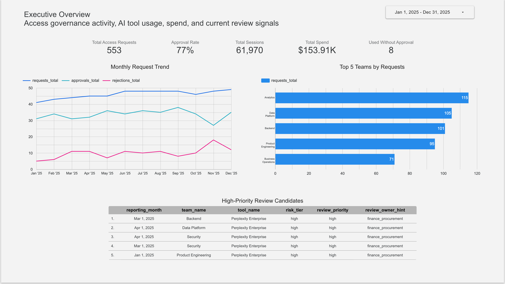
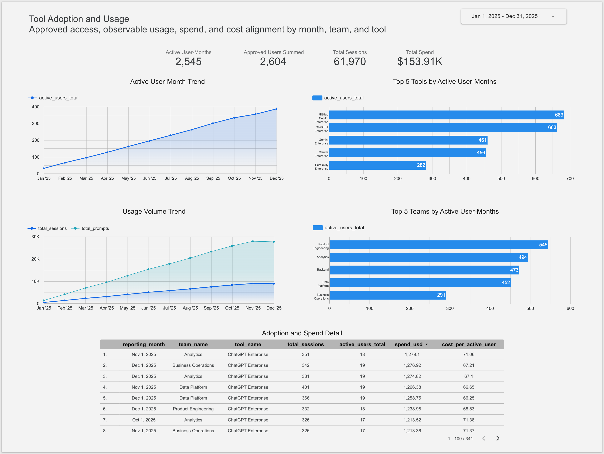
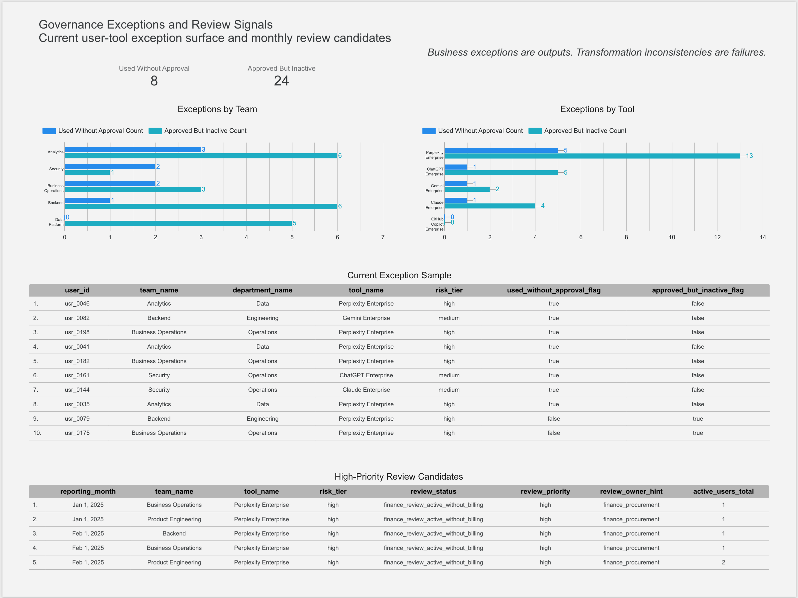

# Looker Studio ダッシュボード（Looker Studio Dashboard）

この文書は、`access-governance-warehouse` v0.2.1 における Looker Studio ダッシュボード成果物を説明します。

## 1. ツール呼称について（Naming note）

Google は 2026 年 4 月に、Looker Studio を Data Studio として再導入することを発表しています。公式発表は次の Google Cloud Blog を参照してください。

[Data Studio returns as new home for Data Cloud assets](https://cloud.google.com/blog/products/data-analytics/looker-studio-is-data-studio)

この repository では、求人票、スキル表記、既存の project artifacts でまだ広く使われている名称との整合性を優先し、以降の documentation では `Looker Studio` という表記を使用します。

## 2. 目的（Purpose）

この文書は、`access-governance-warehouse` v0.2.1 における軽量な Looker Studio ダッシュボード成果物を説明します。

このダッシュボードは、選択した BigQuery 上の dbt mart outputs を、小さな stakeholder-facing report に接続します。目的は、既存の dbt marts が、business logic を dbt の外へ移動させることなく、BI（Business Intelligence）向けの presentation layer を支えられることを示すことです。

このダッシュボードは、production BI infrastructure を意図したものではありません。ローカル DuckDB path と BigQuery execution path を補完する portfolio artifact です。

公開 repository では、screenshots と documentation を reviewable artifacts として使用します。公開 Looker Studio report link は必須ではありません。

## 3. 想定読者（Audience）

このダッシュボードは、次の読者を想定しています。

```text
- 採用担当者
- Analytics Engineering reviewer
- BI reviewer
- Data Engineering reviewer
- access governance activity の概要を確認したい non-technical stakeholder
```

## 4. BI 向け経路（BI-facing path）

このダッシュボードは、v0.2.0 BigQuery execution path の上に追加された BI-facing extension です。

```text
BigQuery marts
  -> embedded Looker Studio data sources
  -> dashboard pages
  -> screenshots and documentation
```

ローカル DuckDB path は、clone してすぐ確認できる primary review path として維持します。  
BigQuery と Looker Studio は、cloud warehouse と BI-facing presentation evidence を提供します。

## 5. データソース方針（Data source strategy）

このダッシュボードは、BigQuery marts に接続した embedded Looker Studio data sources を使用します。

Business logic、review classifications、grains、metric-ready outputs は dbt が所有します。Looker Studio は、presentation、filtering、charting、screenshot-based documentation のために使用します。

このダッシュボードは、公開 report link を必須としません。Screenshots と documentation が repository-facing artifacts です。

## 6. 接続する BigQuery marts

このダッシュボードは、既存の v0.2.0 mart layer を使用します。v0.2.1 では dashboard-specific dbt mart は追加していません。

| Looker Studio data source | BigQuery mart | 目的 |
|---|---|---|
| Access requests monthly | `access_governance_dbt.access_requests_monthly` | request trends、approvals、rejections、backlog、request distribution を表示する |
| Tool adoption monthly | `access_governance_dbt.tool_adoption_monthly` | adoption、usage volume、spend、cost alignment を表示する |
| Adoption review candidates monthly | `access_governance_dbt.adoption_review_candidates_monthly` | monthly review candidates と prioritization signals を表示する |
| Governance exceptions current | `access_governance_dbt.governance_exceptions_current` | current user-tool governance exception surface を表示する |

## 7. ダッシュボードページ（Dashboard pages）

このダッシュボードは 3 ページで構成します。

| Page | 目的 | Primary sources | Screenshot |
|---|---|---|---|
| Executive Overview | access requests、adoption、spend、governance review signals を 1 分で把握できる summary として表示する | `access_requests_monthly`, `tool_adoption_monthly`, `governance_exceptions_current`, `adoption_review_candidates_monthly` | `docs/assets/looker-studio/executive_overview_dashboard.png` |
| Tool Adoption and Usage | approved AI tool access が observable usage につながっているか、usage と spend がどう対応しているかを表示する | `tool_adoption_monthly` | `docs/assets/looker-studio/tool_adoption_dashboard.png` |
| Governance Exceptions and Review Signals | current exception surfaces と monthly review candidates を表示する | `governance_exceptions_current`, `adoption_review_candidates_monthly` | `docs/assets/looker-studio/governance_exceptions_dashboard.png` |

## 8. Page 1: Executive Overview

### 8.1 目的（Purpose）

Executive Overview page は、access governance activity、AI tool usage、spend、current review signals を compact summary として表示します。

### 8.2 実装した可視化要素（Implemented visuals）

| Visual | Source | Metric or dimension | 目的 |
|---|---|---|---|
| Scorecard | `access_requests_monthly` | `requests_total` | total access request volume を表示する |
| Scorecard | `access_requests_monthly` | `approvals_total` と `rejections_total` から計算した approval rate | reviewed requests のうち approved された割合を表示する |
| Scorecard | `tool_adoption_monthly` | `total_sessions` | usage volume を表示する |
| Scorecard | `tool_adoption_monthly` | `spend_usd` | spend scale を表示する |
| Scorecard | `governance_exceptions_current` | used-without-approval rows | current unapproved usage signal を表示する |
| Time series | `access_requests_monthly` | `reporting_month`, `requests_total`, `approvals_total`, `rejections_total` | monthly request and review trends を表示する |
| Bar chart | `access_requests_monthly` | `team_name`, `requests_total` | request volume 上位の teams を表示する |
| Table | `adoption_review_candidates_monthly` | `reporting_month`, `team_name`, `tool_name`, `risk_tier`, `review_priority`, `review_owner_hint` | high-priority review candidates を表示する |

### 8.3 スクリーンショット（Screenshot）



## 9. Page 2: Tool Adoption and Usage

### 9.1 目的（Purpose）

Tool Adoption and Usage page は、approved AI tool access が observable usage につながっているか、また usage と spend がどう対応しているかを表示します。

### 9.2 実装した可視化要素（Implemented visuals）

| Visual | Source | Metric or dimension | 目的 |
|---|---|---|---|
| Scorecard | `tool_adoption_monthly` | `active_users_total` | monthly team-tool mart grain における active user-months を表示する |
| Scorecard | `tool_adoption_monthly` | `approved_users_total` | monthly team-tool rows にまたがって合計した approved users を表示する |
| Scorecard | `tool_adoption_monthly` | `total_sessions` | total usage sessions を表示する |
| Scorecard | `tool_adoption_monthly` | `spend_usd` | total spend を表示する |
| Time series | `tool_adoption_monthly` | `reporting_month`, `active_users_total` | active user-month trend を表示する |
| Time series | `tool_adoption_monthly` | `reporting_month`, `total_sessions`, `total_prompts` | usage volume trend を表示する |
| Bar chart | `tool_adoption_monthly` | `tool_name`, `active_users_total` | active user-months 上位の tools を表示する |
| Bar chart | `tool_adoption_monthly` | `team_name`, `active_users_total` | active user-months 上位の teams を表示する |
| Table | `tool_adoption_monthly` | `reporting_month`, `team_name`, `tool_name`, `total_sessions`, `active_users_total`, `spend_usd`, `cost_per_active_user` | adoption、usage、spend、cost per active user を比較する |

### 9.3 粒度に関する注意（Grain warning）

`tool_adoption_monthly` は次の grain です。

```text
one row per reporting month, team, and tool
```

そのため、`active_users_total` や `approved_users_total` は global distinct user counts として解釈しないでください。これらは monthly team-tool rows にまたがって合計された metrics です。

### 9.4 スクリーンショット（Screenshot）



## 10. Page 3: Governance Exceptions and Review Signals

### 10.1 目的（Purpose）

Governance Exceptions and Review Signals page は、current governance exception surfaces と monthly review candidates を表示します。

この page は、project principle として次の考え方を前提にしています。

> Business exceptions are outputs. Transformation inconsistencies are failures.

### 10.2 実装した可視化要素（Implemented visuals）

| Visual | Source | Metric or dimension | 目的 |
|---|---|---|---|
| Scorecard | `governance_exceptions_current` | `Used Without Approval Count` | recent usage がある一方で approved access がない current user-tool rows を表示する |
| Scorecard | `governance_exceptions_current` | `Approved But Inactive Count` | approved access がある一方で recent 30-day usage がない current user-tool rows を表示する |
| Bar chart | `governance_exceptions_current` | `team_name`, exception counts | team-level exception distribution を表示する |
| Bar chart | `governance_exceptions_current` | `tool_name`, exception counts | tool-level exception distribution を表示する |
| Table | `governance_exceptions_current` | `user_id`, `team_name`, `department_name`, `tool_name`, `risk_tier`, `used_without_approval_flag`, `approved_but_inactive_flag` | personal names や email addresses を表示せず、current exception examples を inspection 可能な形で表示する |
| Table | `adoption_review_candidates_monthly` | `reporting_month`, `team_name`, `tool_name`, `risk_tier`, `review_status`, `review_priority`, `review_owner_hint`, `active_users_total` | high-priority monthly review candidates を表示する |

### 10.3 Looker Studio 計算フィールド（Calculated fields）

次の Looker Studio data-source calculated fields は、既存の dbt mart fields から作成した presentation helpers です。Business classification logic を再実装しているものではありません。

| Calculated field | Source | Formula meaning |
|---|---|---|
| `Used Without Approval Count` | `governance_exceptions_current.used_without_approval_flag` | boolean exception flag を scorecards と bar charts 用の 0/1 metric に変換する |
| `Approved But Inactive Count` | `governance_exceptions_current.approved_but_inactive_flag` | boolean exception flag を scorecards と bar charts 用の 0/1 metric に変換する |

Formula pattern は次の通りです。

```text
CASE
  WHEN used_without_approval_flag THEN 1
  ELSE 0
END
```

### 10.4 個人情報に配慮した表示方針（Privacy-aware display choice）

`governance_exceptions_current` には user-level fields が含まれていますが、この dashboard では `user_name` と `user_email` を意図的に表示していません。

Current exception sample では、synthetic inspection key として `user_id` を使用し、personal names と email addresses は除外しています。これにより、dataset が synthetic data であっても、screenshot artifact として privacy-aware dashboard design に沿う形にしています。

### 10.5 スクリーンショット（Screenshot）



## 11. メトリクス定義（Metric definitions）

| Metric | Definition |
|---|---|
| Total access requests | `access_requests_monthly` の `requests_total` の合計 |
| Approval rate | `SUM(approvals_total) / (SUM(approvals_total) + SUM(rejections_total))`。percent として表示する |
| Latest pending requests | 最新 reporting month における month-end pending request stock |
| Active user-months | reporting month、team、tool rows にまたがる `active_users_total` の合計 |
| Approved users summed | reporting month、team、tool rows にまたがる `approved_users_total` の合計。Global distinct user count ではない |
| Total sessions | `tool_adoption_monthly` の `total_sessions` の合計 |
| Total prompts | `tool_adoption_monthly` の `total_prompts` の合計 |
| Total spend | `tool_adoption_monthly` の `spend_usd` の合計 |
| Cost per active user | `tool_adoption_monthly` の `cost_per_active_user`。mart grain で解釈する |
| Used without approval | recent usage がある一方で approved access がない current user-tool rows |
| Approved but inactive | approved access がある一方で recent 30-day usage がない current user-tool rows |
| High-priority review candidates | `adoption_review_candidates_monthly` で high review priority に分類された rows |

## 12. 粒度メモ（Grain notes）

`access_requests_monthly` は monthly request summary mart です。Request metrics は、mart grain における aggregated request counts として解釈します。

`tool_adoption_monthly` は次の grain です。

```text
one row per reporting month, team, and tool
```

この grain のため、`approved_users_total` や `active_users_total` は global distinct user counts として記述しないでください。これらは monthly team-tool rows にまたがって合計されます。

`governance_exceptions_current` は current snapshot mart です。Monthly time series mart ではないため、この page に date range filtering を強制しないでください。

## 13. フィルターとコントロール設計（Filter and control design）

このダッシュボードでは、単純なページ単位のコントロールを使用し、レポート全体にまたがる複雑な操作挙動は避けています。

| コントロール | 対象フィールド | 対象ページ | 補足 |
|---|---|---|---|
| 期間フィルター | `reporting_month` | Executive Overview; Tool Adoption and Usage | 月次martに対して使用する |
| チームフィルター | `team_name` | 将来の任意拡張 | request、adoption、exception viewsを横断して確認する場合に有用 |
| 部門フィルター | `department_name` | 将来の任意拡張 | stakeholder reviewで部門別に確認する場合に有用 |
| ツールフィルター | `tool_name` または `tool_code` | 将来の任意拡張 | tool-level analysisで有用 |
| リスク階層フィルター | `risk_tier` | 将来の任意拡張 | governance-focused viewで有用 |
| レビュー優先度フィルター | `review_priority` | 将来の任意拡張 | candidate review tableで有用 |
| レビュー状態フィルター | `review_status` | 将来の任意拡張 | source martがreview statusを持つ場合に有用 |

v0.2.1 では、複雑なinteractivityよりも、安定したscreenshot artifactsを優先しています。  
そのため、cross-filtering、viewer-driven sorting、zoomなどのchart interactionsは、public artifactsでは必須としていません。

## 14. マートとダッシュボードの対応（Mart-to-dashboard mapping）

| ダッシュボードで確認する問い | Mart | 主なフィールド |
|---|---|---|
| access requestは何件提出されたか？ | `access_requests_monthly` | `reporting_month`, `requests_total`, `team_name`, `tool_name` |
| review済みrequestのうち、approvedされた割合はどれくらいか？ | `access_requests_monthly` | `approvals_total`, `rejections_total` |
| AI tool usageはどの程度観測されているか？ | `tool_adoption_monthly` | `active_users_total`, `total_sessions`, `total_prompts` |
| adoptionが最も大きいtoolsまたはteamsはどれか？ | `tool_adoption_monthly` | `tool_name`, `team_name`, `active_users_total` |
| usageとspendはどのように対応しているか？ | `tool_adoption_monthly` | `spend_usd`, `cost_per_active_user`, `active_users_total` |
| 現在どのuser-tool rowsをgovernance reviewすべきか？ | `governance_exceptions_current` | `user_id`, `team_name`, `tool_name`, `risk_tier`, `used_without_approval_flag`, `approved_but_inactive_flag` |
| どのmonthly adoption rowsを優先的にreviewすべきか？ | `adoption_review_candidates_monthly` | `review_priority`, `review_status`, `risk_tier`, `review_owner_hint` |

## 15. スクリーンショット（Screenshots）

Screenshots は、この repository における public dashboard artifacts です。

| Page | Screenshot path |
|---|---|
| Executive Overview | `docs/assets/looker-studio/executive_overview_dashboard.png` |
| Tool Adoption and Usage | `docs/assets/looker-studio/tool_adoption_dashboard.png` |
| Governance Exceptions and Review Signals | `docs/assets/looker-studio/governance_exceptions_dashboard.png` |

これらの screenshots は、現在の deterministic v0.2.1 BigQuery mart state を表します。

## 16. スクリーンショットのマスク方針（Screenshot masking policy）

Screenshots では、次の情報を表示しないでください。

```text
- Google Cloud project ID
- user email address
- service account email
- private dashboard URL
- billing-related identifiers
- account-specific identifiers
```

Architectural clarity を支えるため、次の names は見えていても問題ありません。

```text
- access_governance_raw
- access_governance_dbt
- access_requests_monthly
- tool_adoption_monthly
- adoption_review_candidates_monthly
- governance_exceptions_current
- synthetic tool names
- synthetic team names
- synthetic metric values
```

## 17. 共有方針（Sharing policy）

公開 repository では、screenshots と documentation を reviewable dashboard artifacts として使用します。

## 18. 制約事項（Limitations）

このダッシュボードは、意図的に軽量な成果物として作成しています。

v0.2.1 では、次の項目は scope 外です。

```text
- 本番運用向けの BI deployment
- dashboard-as-code
- LookML project setup
- Terraform による BI infrastructure 管理
- 定期的な dashboard 配信
- 本番運用向けの access control design
- viewer ごとの BigQuery access configuration
- 複雑な dashboard theming
- 公開 dashboard link の必須化
```

追加の解釈上の制約は次の通りです。

```text
- この dashboard は決定論的な synthetic data を使用しており、実際の業務データではありません。
- `tool_adoption_monthly` の metrics は reporting month、team、tool の粒度で集計されています。
- `active_users_total` と `approved_users_total` は、全体で一意な user 数ではありません。
- `governance_exceptions_current` は current snapshot mart であり、月次時系列martではありません。
- Looker Studio は表示・可視化のために使用しています。warehouse transformation logic と business classification logic は dbt が所有します。
```

## 19. 再現手順（Reproduction notes）

この dashboard は、v0.2.0 で導入した BigQuery execution path に依存します。

想定される source path は次の通りです。

```text
deterministic Parquet fixtures
  -> BigQuery raw tables
  -> dbt BigQuery target
  -> BigQuery marts
  -> embedded Looker Studio data sources
  -> dashboard pages
  -> screenshots and documentation
```

ローカル DuckDB path は、primary clone-and-run review path として維持します。

Dashboard data source state を再現するには、次の手順を実行します。

1. deterministic raw Parquet fixtures を BigQuery に読み込む。
2. dbt BigQuery target を実行する。
3. 選択した marts が `access_governance_dbt` に存在することを確認する。
4. Looker Studio embedded data sources を選択した BigQuery marts に接続する。
5. 3 つの dashboard pages を再作成または確認する。
6. 再作成した dashboard を、`docs/assets/looker-studio/` 配下にコミット済みの screenshots と比較する。

この dashboard は公開 Looker Studio link を必要としません。Repository-facing artifacts は、この文書とコミット済み screenshots です。

## 20. ダッシュボード原則（Dashboard principle）

Business exceptions are outputs. Transformation inconsistencies are failures.
